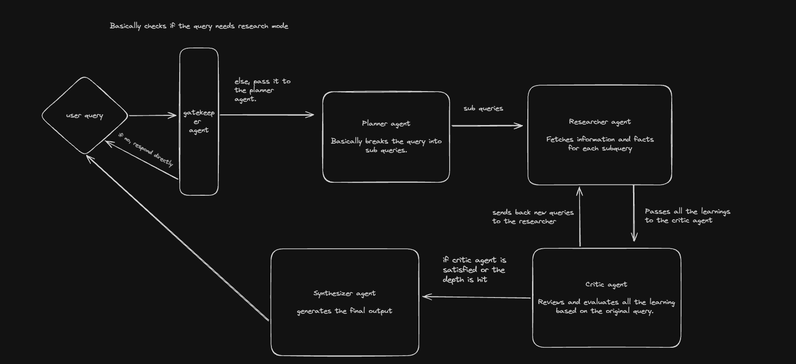

# Decision Note

## 1. Architecture & Approach

### Agent Roles & Responsibilities

*   **Gatekeeper Agent:** Acts as the entry point. Evaluates the user query to determine if it requires deep, recursive research or if it can be answered immediately as a simple direct response.
*   **Planner Agent:** Receives complex queries from the Gatekeeper. Its sole responsibility is to break down the main query into distinct sub-questions required to form a complete answer.
*   **Researcher Agent(s):** Takes a single sub-question, queries the search API and extracts the most relevant information. To minimize latency, multiple Researchers are spun up concurrently to handle all sub-questions simultaneously.
*   **Critic Agent:** The evaluator of the system. It reviews all aggregated findings against the original query. If the information is incomplete, it generates new, targeted sub-queries and routes them back to the Researchers. It enforces the `max_depth` budget to prevent runaway loops.
*   **Synthesizer Agent:** Activated only when the Critic is satisfied (or the budget is hit). It compiles all approved research into the final report.

## 2. Alternatives Considered & Rejected

*   **Hierarchical "Supervisor-Worker"** Considered using a  "Manager LLM" to dynamically decide when to spawn researchers and when to stop. **Rejected because:** It can get wildly expensive and also relying purely on an LLM for control flow is slow, unpredictable, and risks exceeding API budgets.
*   **Blackboard / Shared Memory Architecture:** Considered an architecture where agents do not communicate directly, but instead read and write tasks to a global "Blackboard" database asynchronously. **Rejected because:** Often overkill for a small project. Can lead to race conditions or agents overwriting each other if not carefully managed.

## 3. Technology Choices

*   **LLM Choice & "Swappable Config" Pattern:** Instead of hardcoding a single LLM, the system now features a flexible, multi-provider architecture supporting both **OpenAI** and **Amazon Bedrock** (including Anthropic models). The system dynamically toggles between **"fast" models** (for high-speed, lower-reasoning tasks like the Gatekeeper, Researcher, and Synthesizer) and **"reasoning" models** (for complex tasks like the Planner and Critic). This is managed via environment variables (e.g., `BEDROCK_FAST_MODEL` vs `OPENAI_REASONING_MODEL`), giving us the best of both worlds: low latency and minimal cost where possible, and high intelligence where necessary.
*   **State Management & Orchestration:** I used **LangGraph** (`@langchain/langgraph`) to orchestrate the agents. It allows defining a robust `StateGraph` where each node represents an agent and edges define the conditional routing (e.g. `Gatekeeper -> Planner` or looping `Critic -> Researcher`). LangGraph's strictly typed `Annotation.Root` state ensures a structured payload is cleanly handed off between iterations.
*   **Search API:** I opted for the Tavily API. As per my research, Tavily searches based on keywords and facts, returning a highly summarized output instead of raw text. The obvious trade-off here is speed over depth. I also considered Firecrawl, which scrapes the entire page (giving you full depth and the complete output), as well as Exa, which searches on a semantic basis. We could have even used a hybrid approach (getting URLs from Tavily or Exa and then manually scraping the web pages) but I think that would be total overkill for this. Ultimately, for a fast, recursive multi-agent loop, optimizing for speed and pre-summarized context (Tavily) made the most sense.

## 4. Cost Control & Parallelism

*   **The Gatekeeper:** This agent serves to prevent unnecessary API usage and token expenditure. By intercepting simple or conversational queries before they trigger the deep research pipeline, the Gatekeeper ensures that intensive recursive research is only executed when genuinely required.
*   **Cost-Aware Decisions:** The architecture incorporates multiple cost-saving measures without sacrificing quality. These include utilizing Tavily for summarized search results rather than performing expensive full-page scrapes, enforcing strict limits on recursion depth, and dynamically provisioning more efficient models for lower-complexity tasks.
*   **Recursion Budget:** We enforce a strict depth limit using `MAX_DEPTH` (configured via env). We ideally let the agent decide the depth based on query complexity, but limiting it ensures the LLM doesn't push the depth beyond a limit for obvious cost reasons.
*   **Parallelism:** To minimize total time-to-completion, the orchestration layer executes the Researcher nodes concurrently. Fetching multiple sub-queries simultaneously prevents network bottlenecks.
*   **The Balance:** But I think we should keep a balance. It shouldn't be that in the effort to reduce costs, our system becomes trash. There should always be a balance.

## 5. Architectural Enhancements

To ensure the system remains robust, efficient, and cost-effective compared to other deep research agents on the market, several specific architectural enhancements were implemented:

*   **Concurrency Control (`p-limit`):** When the Planner generates multiple sub-queries, firing them all off simultaneously can hit API rate limits or cause network bottlenecks. By wrapping the parallel execution in `p-limit`, we maintain high-speed concurrent fetching while strictly controlling the maximum number of active requests at any given time.
*   **Critic Garbage Collection:** As the system loops, the context window can quickly fill up with irrelevant or low-quality search results. The Critic agent actively identifies and flags useless sources (`rejectedSourceIndices`). These are purged from the system's state before the next iteration, acting as a garbage collector that keeps the context clean and drastically reduces token costs.
*   **In-Memory Source Deduplication:** Across multiple sub-queries and recursive loops, search engines often return the same popular URLs. The Researcher maintains an in-memory `Set` of previously visited URLs. Duplicate links are immediately discarded before being processed, preventing redundant data from polluting the context window and saving tokens.
*   **Fault-Tolerant Batching:** In the Researcher, sub-queries are executed using `Promise.allSettled` rather than `Promise.all`. This guarantees that if a single API call fails or times out, it won't crash the entire batch of concurrent searches, ensuring partial data is always recovered.

## 6. What We Might Build (Or Skip)

If I end up getting some spare time at the end, here are a few things I might wire up:

*   **The Final Reflection Pass:** A final node where the system re-reads its own synthesized report and does one last check for any hidden gaps.
*   **Cost & Latency Tracking:** Adding basic telemetry to log exactly how many tokens we burned and the total execution time for the recursive loop.
*   **A Simple Web UI:** Wiring up a very basic frontend just to make the agent easier to interact with instead of just running it in the terminal.

But for now, my whole focus is strictly on making the actual agent logic as robust and effective as possible.